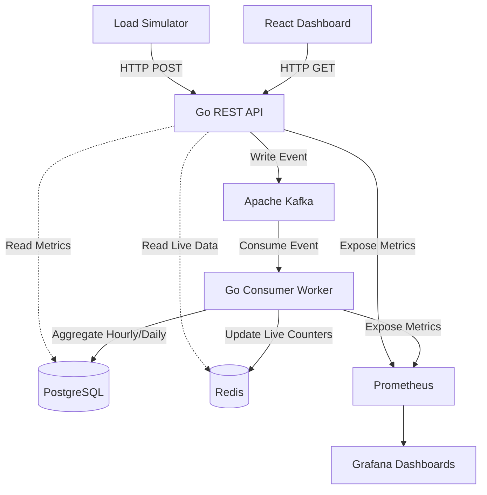

# LLMWatch - AI Observability Platform

LLMWatch is a comprehensive observability platform designed to monitor, analyze, and aggregate metrics for Large Language Model (LLM) applications. It provides real-time visibility into LLM usage, latency, error rates, and costs across multiple providers (OpenAI, Anthropic, Gemini).

## 🏗 Architecture Overview

The system is built using a modern, event-driven microservices architecture optimized for high-throughput observability data.

## 🛠 Technology Stack

### Backend Services
- **Go (Golang)**: The primary language used for the backend due to its high performance, concurrency primitives, and low memory footprint.
- **Chi Router**: A lightweight, idiomatic, and composable router for building the REST API.
- **Go-Migrate**: Handles database migrations gracefully.

### Event Streaming & Message Queue
- **Apache Kafka**: Acts as the central nervous system. The API publishes raw LLM events to Kafka asynchronously, ensuring the API responds to the client immediately without waiting for database writes.
- **Apache Zookeeper**: Manages Kafka brokers and coordinates cluster state.

### Data Storage & Caching
- **PostgreSQL**: The primary relational database. It stores the time-series aggregations (hourly rollups of token usage, costs, and latencies) and historical data.
- **Redis**: An in-memory data store used to maintain real-time rolling metrics (e.g., calls per minute, live error rates).

### Frontend
- **React 18**: Used for building the dynamic user interface.
- **TypeScript**: Provides strong typing for the React frontend, reducing bugs.
- **Vite**: A lightning-fast build tool and development server.
- **Tailwind CSS**: Utility-first CSS framework for styling the sleek, dark-mode dashboard.
- **Recharts**: A composable charting library built on React components for rendering the data visualizations.

### Infrastructure & DevOps
- **Docker & Docker Compose**: Containerizes all services and manages the multi-container application lifecycle.
- **Prometheus**: Scrapes and stores internal operational metrics from the Go API and Consumer (e.g., memory usage, GC pauses, HTTP request latencies).
- **Grafana**: Visualizes the operational metrics scraped by Prometheus.

## 📦 Core Components

### 1. Go REST API (`/cmd/api`)
The ingestion and serving layer. 
- Receives incoming `LLMCallEvent` JSON payloads from clients.
- Validates the payload and publishes it directly to a Kafka topic (`llm_events`) for asynchronous processing.
- Serves HTTP endpoints used by the React frontend to query aggregated metrics from Postgres and Redis.

### 2. Go Consumer (`/cmd/consumer`)
The background worker.
- Subscribes to the `llm_events` Kafka topic.
- Processes incoming events and updates real-time counters in Redis (e.g., sliding window metrics for the last 60 minutes).
- Performs upserts into Postgres to maintain aggregated hourly metrics (total tokens, sum of latencies, total cost, etc.).

### 3. React Dashboard (`/frontend`)
The single-page application (SPA).
- Polls the API every few seconds for live updates.
- Displays key performance indicators (KPIs) like total calls, average latency, total cost, and error rate.
- Renders detailed charts:
  - **Calls Per Minute**: A live line chart of request volume.
  - **Latency Percentiles**: A bar chart showing P50, P95, and P99 latencies broken down by provider.
  - **Cost by Provider**: A donut chart illustrating cost distribution.

### 4. Load Simulator (`/cmd/simulator`)
A synthetic data generator.
- Generates realistic LLM events with randomized but realistic latencies, token counts, error rates, and providers.
- Pushes events to the API to simulate live production traffic and test the system under load.

## 🚀 How Data Flows

1. An application makes an LLM call to OpenAI.
2. The application sends an observability event to the **LLMWatch API**.
3. The API quickly validates the request and places the event on a **Kafka queue**. It returns a `202 Accepted` to the client instantly.
4. The **Go Consumer** picks up the event from Kafka.
5. The Consumer increments the "live calls" counter in **Redis** and calculates the cost.
6. The Consumer updates the current hour's aggregated row in **PostgreSQL**.
7. You open the **React Dashboard**, which requests the latest metrics from the API.
8. The API fetches the real-time data from Redis and historical data from Postgres, sending it to the UI to be graphed.
